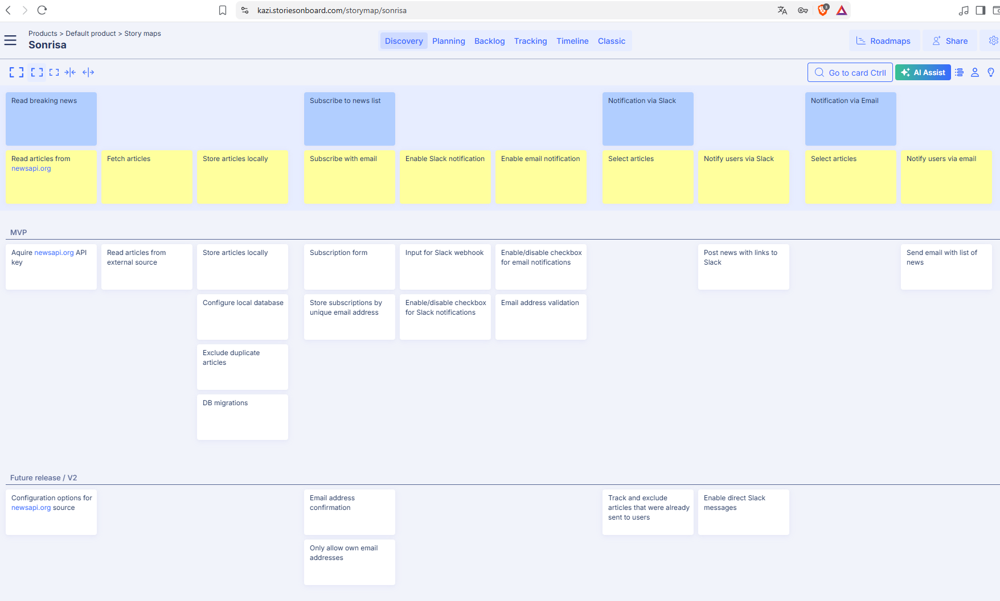
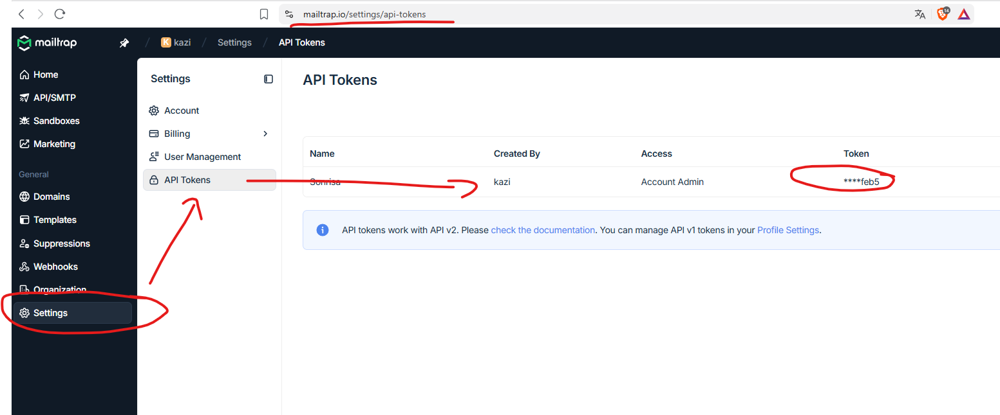
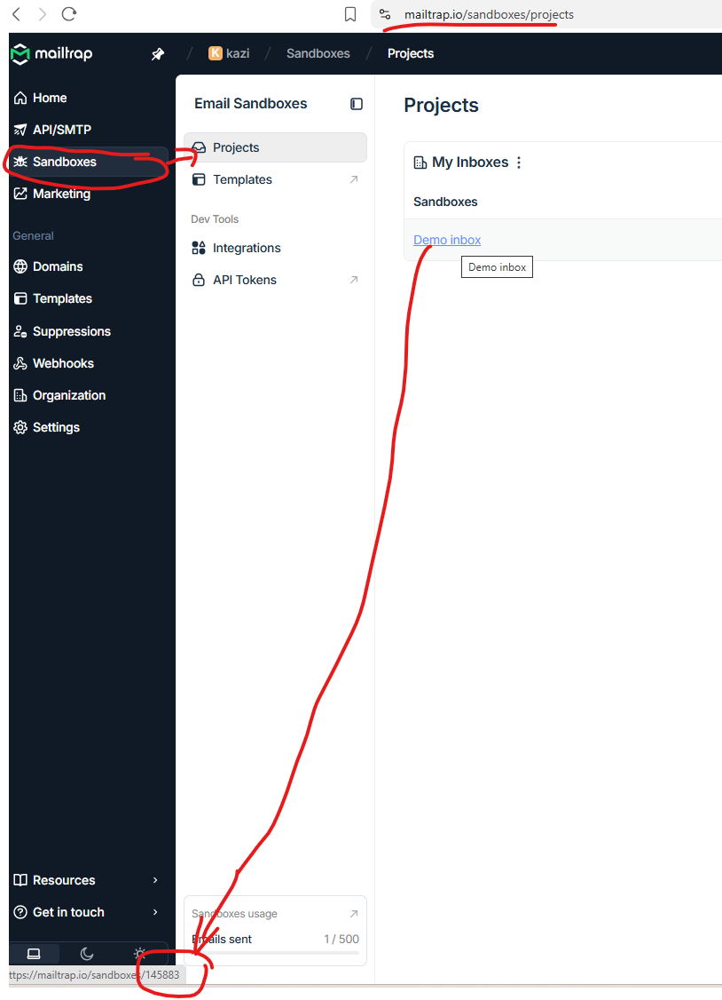
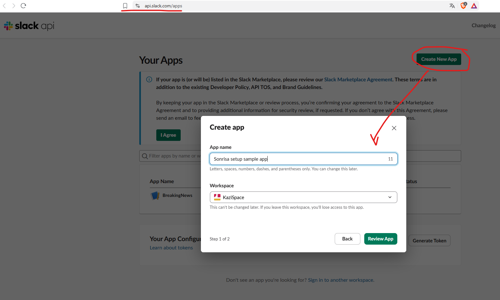
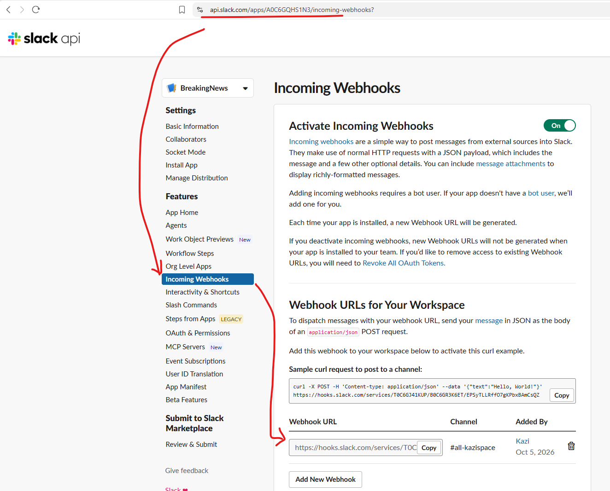
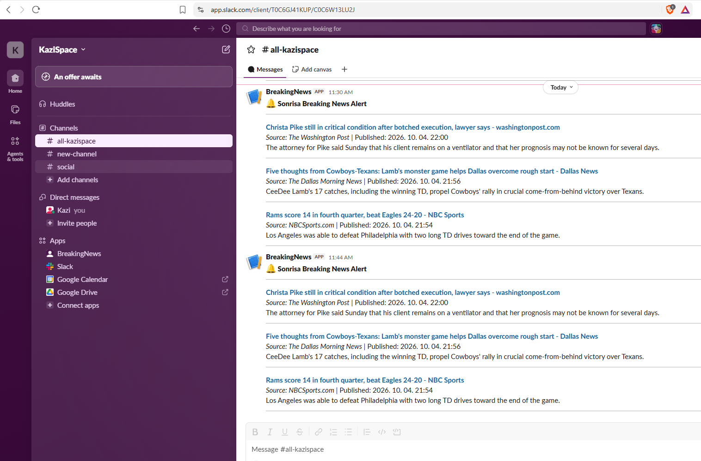
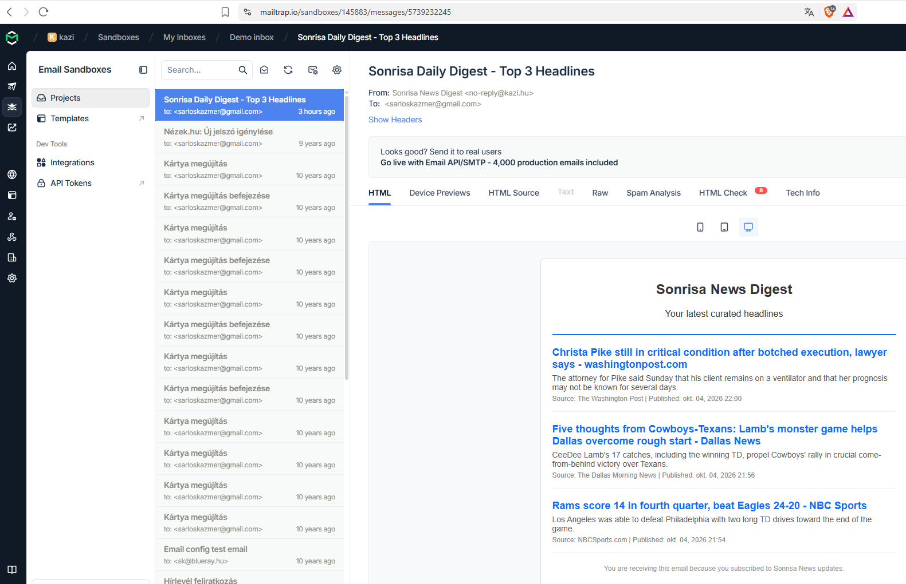

# Sonrisa news feed
Breaking news dispatcher for Sonrisa

**Dear Sonrisa,**

Thank you for the opportunity to work on this project. I have created a simple news feed aggregator that fetches breaking news from the NewsAPI and sends email notifications to users who have subscribed to alerts. The application is built using ASP.NET Core and uses Mailtrap for email delivery in a sandbox environment. Users can also opt in to get notifications via Slack to any available Slack channel through Slack Webhooks.

## The task

*We want users to be able to set up alerts so they get notified when
something important happens in the world — like breaking news, market
movements, natural disasters, that kind of thing. Should work for both email
and Slack. Make it flexible enough that we can add more channels later.
We need an admin view too.*

## Planning

I created a user story map for ideation and to find and fill out gaps in the requirements. The secondary purpose of the story map is to aid development and AI tools by always providing context (goals and steps towards goals) to a given user story. 
The user story map is available here: https://kazi.storiesonboard.com/storymap/shared/My8KUEmxLke8zrHhvxdXIg



The story map gave me a holistic view of the requirements and helped me to identify the following key features for the application:
- Fetch breaking news from a news API (NewsAPI)
- Store user subscriptions for email and Slack notifications
- Send email notifications to users who have subscribed to alerts
- Send Slack notifications to users who have subscribed to alerts
- Provide an admin dashboard to view delivery logs and trigger notifications

It also helped scope the MVP that would be delivered in the first iteration.

I used Gemini AI to generate a high-level architecture diagram for the application and to create an implementation plan.
[Gemini prompts](./Assets/gemini-prompts.pdf) and help me with the rest of the implementation.


## Solution overview

The application implements a news feed aggregator that fetches breaking news from the NewsAPI and sends email notifications to users who have subscribed to alerts. 
The application is built using ASP.NET Core and uses Mailtrap for email delivery in a sandbox environment. Users can also opt in to get notifications via Slack to any available Slack channel through Slack Webhooks.

## Configuration

Please take a look at the `appsettings.json` file for configuration details. 

The only thing you need to configure is the **Mailtrap API key and inbox ID**.
- Current implementation uses a sandbox Mailtrap account for email delivery, and does not allow to send emails to real addresses from localhost. 
- You can sign up for a free account at [Mailtrap](https://mailtrap.io/) and get your own API key and inboxId so that you can see outgoing emails.

```
{
  "Logging": {
    "LogLevel": {
      "Default": "Information",
      "Microsoft.AspNetCore": "Warning"
    }
  },
  "AllowedHosts": "*",
  "NewsApi": {
    "ApiKey": "2e2f8f7a0210481d8cc087773daa917e"
  },
  "Admin": {
    "Password": "SonrisaAdmin123!"
  },
  "Mailtrap": {
    "InboxId": "145883",
    "ApiToken": "e8a95c31c9ecf8d1751ec46c5336feb5",
    "FromEmail": "no-reply@kazi.hu",
    "FromName": "Sonrisa News Digest"
  }
}
```

### Mailtrap configuration

After restering for a free Mailtrap account, you'll find the API key in the settings page below.


After registering for a free Mailtrap account, you'll find the inbox Id in the URL below.


### Slack configuration

One will need to create a Slack app and enable incoming webhooks to get the webhook URL. The Slack app can be created at https://api.slack.com/apps. After creating the app, enable incoming webhooks and create a new webhook for your desired channel. The webhook URL will be used in the subscription form to send notifications to that channel.



Copy the webhook URL and paste it into the subscription form to receive notifications in your Slack channel. The webhook URL will look something like this: `https://hooks.slack.com/services/SOME-ID`



## Running the application

1. Build the application using Visual Studio
2. Launch the application and visit: http://localhost:5128/

The application will show the list of news items. The *Sync Latest Headlines* button allows you to refresh the top stories.
The *Subscribe* page allows you to subscribe to the notifications. Emails will arrive after checking the Receive Breaking News Emails option, and Slack notifications will arrive after provoding the necessary Slack Incoming Webhook URL.
Your subscription may be changed by submitting the same for with different settings again. 

The *Admin dashboard* requires authentication. Use the password: **SonrisaAdmin123!** to get access to the administrative features. You will see a delivery log alongside some stats, and you also have the option to trigger the Slack and email notifications.

## Some screenshots I made during development & testing

Slack notification in a channel:



Notification emails arriving in the Mailtrap inbox:


